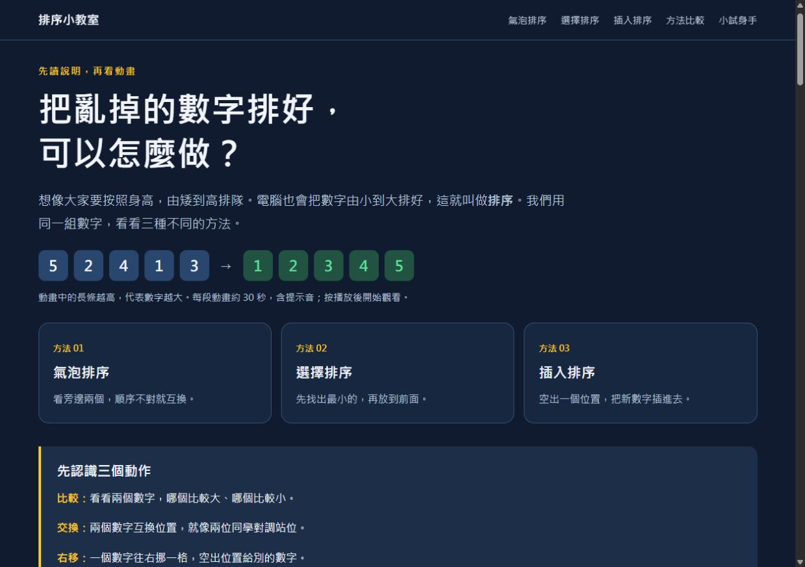

# 排序小教室

給國中生的排序教學頁面：氣泡排序、選擇排序、插入排序。
每一節先讀白話說明，再看 30 秒有聲動畫，最後用比較表與小練習複習。

## 在電腦上觀看

用瀏覽器開啟 `index.html`。三支有聲影片放在專案內的 `videos` 資料夾，網頁會直接讀取它們，離線也能播放。請保留整個資料夾結構。

## 專案內容

```text
sorting-lesson/
├── index.html
├── videos/
│   ├── bubble-sort.mp4
│   ├── selection-sort.mp4
│   └── insertion-sort.mp4
├── preview.jpg
├── README.md
└── .nojekyll
```

## 上傳到 GitHub Pages

1. 解壓縮 `sorting-lesson.zip`。
2. 將 `sorting-lesson` 裡的全部檔案與 `videos` 子資料夾一起上傳到儲存庫根目錄，讓 `index.html` 位於最外層。不要只上傳 HTML。
3. 到 **Settings → Pages**，選 **Deploy from a branch**。
4. 選擇 **main** 與 **/(root)**，按 **Save**。
5. 等發布完成後，從 Pages 設定頁開啟網站並分享網址。

首頁檔案是 `index.html`；`preview.jpg` 是頁面預覽；`.nojekyll` 可讓 GitHub Pages 直接發布這些檔案。


